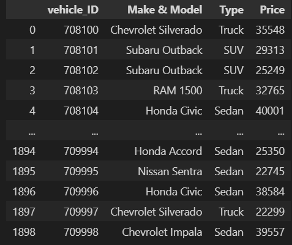
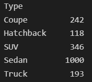
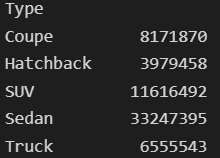
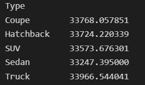
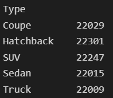
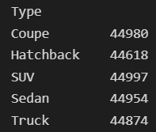
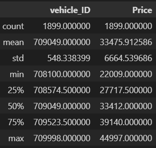
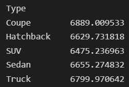
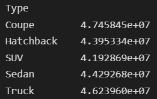

# Pandas DataFrames: Aggregate Functions
## Introduction
#### When conducting data analyses, we soemtimes want to shift between levels of detail to look at the data from different perspectives. One way Pandas offers this functionality is by providing Aggregate Functions. The various aggregate functions provided by Pandas are listed and described below.
## DataFrames Used in This Tutorial
#### To keep the examples in this tutorial consistent, we will be using the following DataFrame:
#### vehicles

## Commonly Used Aggregate Functions
### count()
#### - Just like in Excel and SQL, this function is used to count the number of items within a specified group. In the context of DataFrames, you need to group categorical columns (where there are discrete values) and aggregate by a numerical column. To use this function, use the following syntax:
    [dataframe name].groupby([categorical column name])[[value column name]].count()
#### Example:
    vehicles.groupby('Type')['Price'].count()

### sum()
#### - This is the most basic aggregate function used for analysis. This function is used to add together all the values of the numerical column within each category from the categorical column. To use this function, use the following syntax:
    [dataframe name].groupby([categorical column name])[[value column name]].sum()
#### Example:
    vehicles.groupby('Type')['Price'].sum()

### mean()
#### - This function returns the average for each categorical value. This is calculated by dividing the sum by the count. To use this function, use the following syntax:
    [dataframe name].groupby([categorical column name])[[value column name]].mean()
#### Example:
    vehicles.groupby('Type')['Price'].mean()

### min()
#### - This function returns the smallest value for each categorical value. To use this function, use the following syntax:
    [dataframe name].groupby([categorical column name])[[value column name]].min()
#### Example:
    vehicles.groupby('Type')['Price'].min()

### max()
#### - This function returns the largest value for each categorical value. To use this function, use the following syntax:
    [dataframe name].groupby([categorical column name])[[value column name]].max()
#### Example:
    vehicles.groupby('Type')['Price'].max()

## Other Aggregate Functions for Statistical Analysis
### describe()
#### - This method returns a list of descriptive statistics that outline the different numerical features of the DataFrame. To use this method, use the following syntax:
    [dataframe name].describe()
#### Example:
    vehicles.describe()

### std()
#### - This function returns the standard deviation of each categorical value. To use this function, use the following syntax:
    [dataframe name].groupby([categorical column name])[[value column name]].sd()
#### Example:
    vehicles.groupby('Type')['Price'].std()

### var()
#### - This function returns the variance of each categorical value. To use this function, use the following syntax:
    [dataframe name].groupby([categorical column name])[[value column name]].var()
#### Example:
    vehicles.groupby('Type')['Price'].var()

## Next Steps
#### Congratulations! You have now completed the Beginner level of Pandas. To continue on your learning journey, check out the first Advanced tutorial:
- [Pivot Tables](link)
