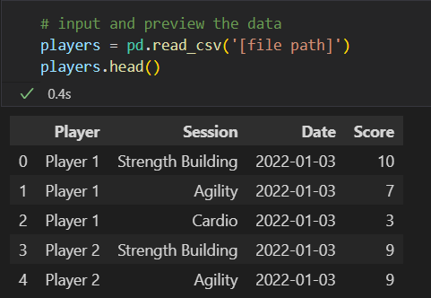
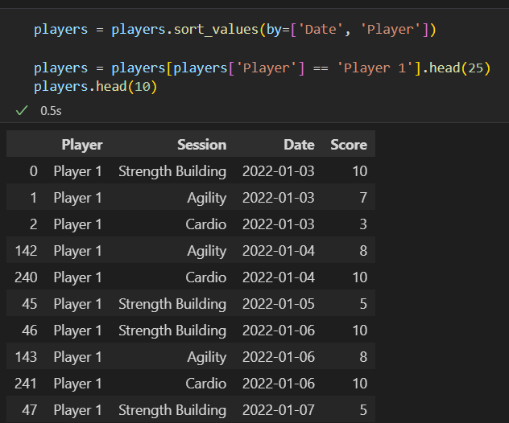
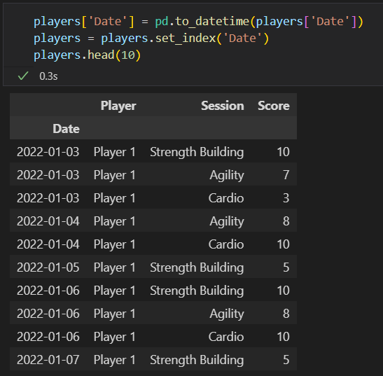
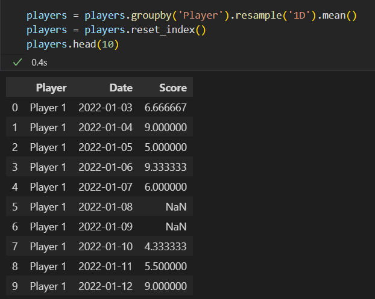

# Advanced Pandas: Date Scaffolding
## Introduction
#### When you're working with dates, there may come a time when some dates may be missing or you would like to change the level of detail from months to days. To help with these issues, there is an advanced data manipulation techniques known as _Date Scaffolding_. Although Pandas doesn't have a specified function to help with this process, it still provides us with the tools necessary to fill in the missing data.
## Files Used in This Tutorial
#### To help keep the examples in this tutorial consistent, please click the link below to download the input file used in this tutorial:
- [Input File](Files/Player-Training.zip)
## Date Scaffolding Techniques
### Filling in Missing Dates
#### - As mentioned above, sometimes dates will be missing in your dataset. There are various ways to go about solving this problem so we'll start with the most simple method:
##### 1. Setup your Project:
        import pandas as pd
        players = pd.read_csv('[file path]')
        players.head()

##### 2. Organize DataFrame to Identify Missing Dates:
        players = players.sort_values(by=['Date', 'Player'])
        players = players[players['Player'] == 'Player 1'].head(25)
        players.head(10)

##### 3. Convert Date Convert "Date" Column to Date Data Type and Set as Index:
        players['Date'] = pd.to_datetime(players['Date'])
        players = players.set_index('Date')
        players.head(10)

##### 4. Group by Player and Resample the Date Index and Convert to Discrete Measure:
        players = players.groupby('Player').resanple('1D').mean()
        players = players.reset_index()
        players.head(10)

