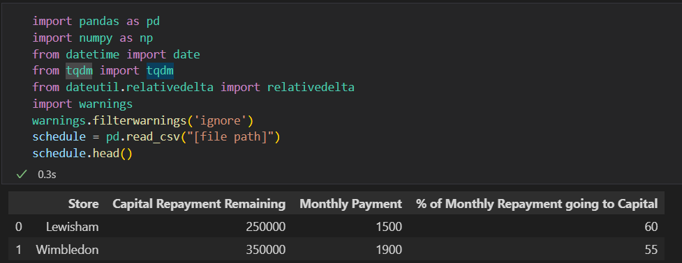
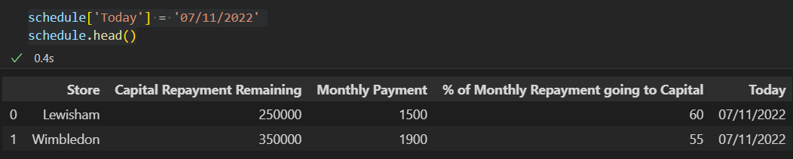
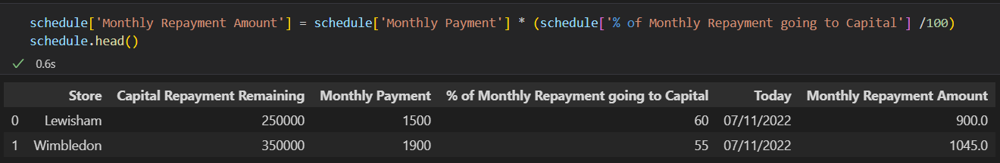
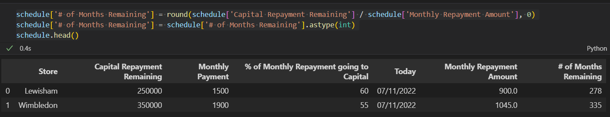
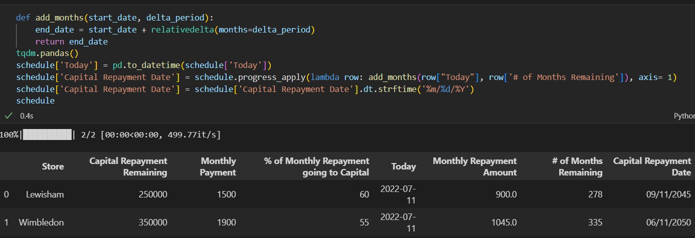
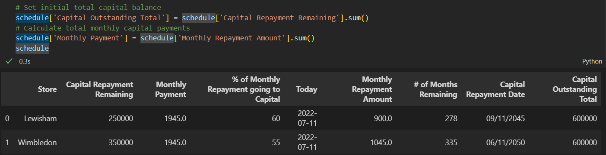
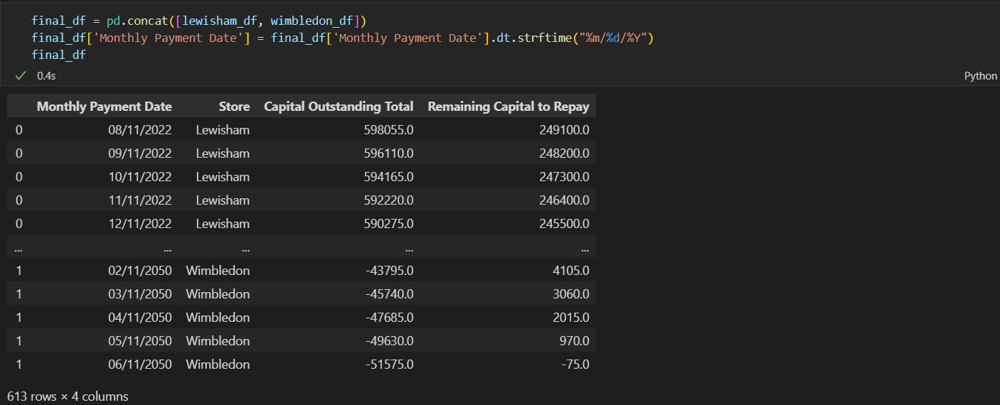

# Advanced Pandas: Date Scaffolding
## Introduction
#### When you're working with dates, there may come a time when some dates may be missing or you would like to change the level of detail from months to days. To help with these issues, there is an advanced data manipulation techniques known as _Date Scaffolding_. Although Pandas doesn't have a specified function to help with this process, it still provides us with the tools necessary to fill in the missing data.
## Files Used in This Tutorial
#### To help keep the examples in this tutorial consistent, please click the link below to download the input file used in this tutorial:
- [Input File 1](Files/Player-Training.zip)
- [Input File 2](Files/Amortization-Schedule.zip)
## Date Scaffolding Techniques
### Filling in Missing Dates
#### - As mentioned above, sometimes dates will be missing in your dataset. There are various ways to go about solving this problem so we'll start with the most simple method:
##### 1. Setup your Project:
        import pandas as pd
        players = pd.read_csv('[file path]')
        players.head()

##### 2. Organize DataFrame to Identify Missing Dates:
        players = players.sort_values(by=['Date', 'Player'])
        players = players[players['Player'] == 'Player 1'].head(25)
        players.head(10)

##### 3. Convert Date Convert "Date" Column to Date Data Type and Set as Index:
        players['Date'] = pd.to_datetime(players['Date'])
        players = players.set_index('Date')
        players.head(10)

##### 4. Group by Player and Resample the Date Index and Convert to Discrete Measure:
        players = players.groupby('Player').resanple('1D').mean()
        players = players.reset_index()
        players.head(10)

#### **Although it may be difficult to tell, the NaN values in the 4th step indicate values that were added after the resample.**

### Changing the Level of Detail in a DataFrame
#### - When you are working with any time-series datasets, it can be difficult to understand the level of detail needed for your analysis. The first step in this process is to understand the problem you're trying to solve and the questions being asked by stakeholders. In the example below, we will be changing the level of detail for a mortgage payment schedule, better known as an "Amortization Schedule":
##### 1. Setup your project:
        import pandas as pd
        import numpy as np
        from datetime import date
        from tqdm import tqdm
        from dateutil.relativedelta import relativedelta
        import warnings
        warnings.filterwarnings('ignore')
        schedule = pd.read_csv('[file path]')
        schedule

##### 2. Set Value for the Start Date:
        schedule['Today'] = '07/11/2022'
        schedule

##### 3. Create a Date Field to Show Repayment Amount:
        schedule['Monthly Repayment Amount'] = schedule['Monthly Payment'] * (schedule['% of Monthly Repayment going to Capital'] /100)
        schedule

##### 4. Create a Field to Show # of Months Remaining on Mortgage:
        schedule['# of Months Remaining'] = round(schedule['Capital Repayment Remaining'] / schedule['Monthly Repayment Amount'], 0)
        schedule['# of Months Remaining'] = schedule['# of Months Remaining'].astype(int)
        schedule

##### 5. Create a Field to Show When the Mortgage Will Be Paid Off:
        def add_months(start_date, delta_period):
            end_date = start_date + relativedelta(months=delta_period)
            return end_date
        tqdm.pandas()
        schedule['Today'] = pd.to_datetime(schedule['Today'])
        schedule['Capital Repayment Date'] = schedule.progress_apply(lambda row: add_months(row["Today"], row['# of Months Remaining']), axis= 1)
        schedule['Capital Repayment Date'] = schedule['Capital Repayment Date'].dt.strftime('%m/%d/%Y')
        schedule

##### 6. Create Two Fields: One to Display the Total Amount of Capital Remaining, and Another to Display the Sum of Monthly Contribution:
        schedule['Capital Outstanding Total'] = schedule['Capital Repayment Remaining'].sum()
        schedule['Monthly Payment'] = schedule['Monthly Repayment Amount'].sum()
        schedule

##### 7. Create New DataFrames for Each Store and Complete the following steps:
        a. Create a Column Speicfying the Individual Monthly Contributions for Each Store
                lewisham_df = schedule[schedule['Store'] == 'Lewisham']
                wimbledon_df = schedule[schedule['Store'] == 'Wimbledon']
                
                lewisham_df['Lewisham Monthly Payment'] = np.where(lewisham_df['Store'] == 'Lewisham', 900.0, 1045.0)
                wimbledon_df['Wimbledon Monthly Payment'] = np.where(wimbledon_df['Store'] == 'Wimbledon', 1045.0, 900.0)
                display(lewisham_df)
                display(wimbledon_df)
        b. Convert Repayment Date Column to Datetime
                lewisham_df['Capital Repayment Date'] = pd.to_datetime(lewisham_df['Capital Repayment Date'])
                wimbledon_df['Capital Repayment Date'] = pd.to_datetime(wimbledon_df['Capital Repayment Date'])
                display(lewisham_df)
                display(wimbledon_df)
        c. Scaffold the Dates
                lewisham_df['Monthly Payment Date'] = [pd.date_range(x, y, freq='M') + pd.DateOffset(days=11) for x, y in zip(lewisham_df['Today'], lewisham_df['Capital Repayment Date'])]
                wimbledon_df['Monthly Payment Date'] = [pd.date_range(x, y, freq='M') + pd.DateOffset(days=11) for x, y in zip(wimbledon_df['Today'], wimbledon_df['Capital Repayment Date'])]
                display(lewisham_df)
                display(wimbledon_df)
        d. Show the Date Scaffold
                lewisham_df = lewisham_df.explode('Monthly Payment Date')
                wimbledon_df = wimbledon_df.explode('Monthly Payment Date')
                display(lewisham_df.head())
                display(wimbledon_df.head())
        e. Create a Temporary Dictionary for Remaining Capital
                s = {'Monthly Payment': 600000 - lewisham_df['Monthly Payment'].cumsum()}
                s2 = {'Monthly Payment': 600000 - wimbledon_df['Monthly Payment'].cumsum()}
        f. Calculate the Reverse Cumulative Sum
                lewisham_df['Capital Outstanding Total'] = s['Monthly Payment']
                wimbledon_df['Capital Outstanding Total'] = s2['Monthly Payment']
                display(lewisham_df.head())
                display(wimbledon_df.head())
        g. Create Temporary Dictionary for Remaining Individual Capital
                d = {'Store': lewisham_df['Store'], 'Capital Outstanding Total': 250000 - lewisham_df['Lewisham Monthly Payment'].cumsum()}
                d2 = {'Store': wimbledon_df['Store'], 'Capital Outstanding Total': 350000 - wimbledon_df['Wimbledon Monthly Payment'].cumsum()}
        h. Calculate the Reverse Cumulative Sum
                lewisham_df['Remaining Capital to Repay'] = d['Capital Outstanding Total']
                wimbledon_df['Remaining Capital to Repay'] = d2['Capital Outstanding Total']
                display(lewisham_df.head())
                display(wimbledon_df.head())
        i. Reorganize Columns
                lewisham_df = lewisham_df[['Monthly Payment Date', 'Store', 'Capital Outstanding Total', 'Remaining Capital to Repay']]
                wimbledon_df = wimbledon_df[['Monthly Payment Date', 'Store', 'Capital Outstanding Total', 'Remaining Capital to Repay']]
                display(lewisham_df.head())
                display(wimbledon_df.head())
##### 8. Union the DataFrames and Format the Monthly Payment Date Column:
        final_df = pd.concat([lewisham_df, wimbledon_df])
        final_df['Monthly Payment Date'] = final_df['Monthly Payment Date'].dt.strftime("%m/%d/%Y")
        final_df
#### Output:

