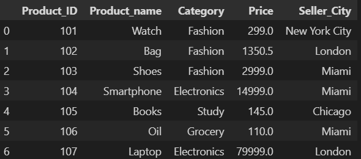
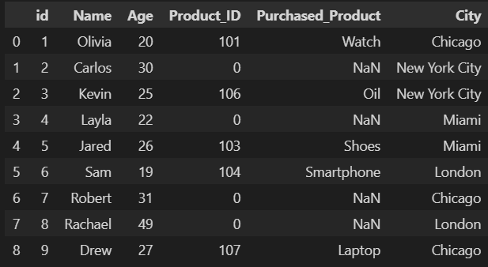
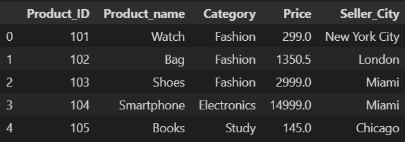
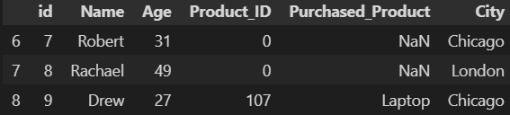
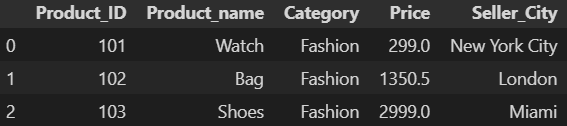
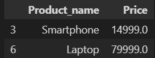
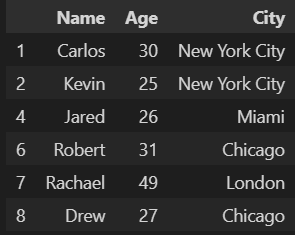
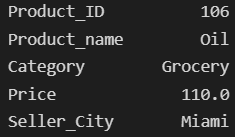
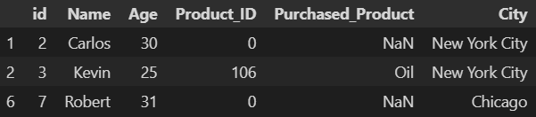

# Pandas DataFrames: Filtering Techniques
## Introduction
#### When working with large amounts of data, filtering can be a saving grace in your querying practices. Pandas offers multiple options for how to filter your DataFrames, ranging from simple methods to advanced conditional statements. Let's take a look at what Pandas has to offer:
## DataFrames Used in This Tutorial
#### To help keep this tutorial consistent, we will be using the "products" and "customers" DataFrames as shown below:
### products

### customers

## Common Filtering Techniques
### Previewing a DataFrame
#### - When you are working with "larger than memory" DataFrames, it may be helpful to simply preview the first or last few rows. To do this, we can utilize Pandas' head() and tail() methods. These methods use the following syntaxes:
    - [dataframe name].head([# of rows]*)
    - [dataframe name].tail([# of rows]*)
        * If you don't specify a number of rows, Pandas will return a default of five rows. 
#### Examples:
    products.head()
  
  
    customers.tail(3)
  
### Filtering Using DataFrame Queries
#### - When working with DataFrames, there are multiple ways to do just about everything. An example of this is with filtering. The easiest way to apply a single filter to a DataFrame is to use the following syntax:
    [dataframe name][[dataframe name][column name] [logical operator] [value]]
#### Example:
    products[products['Category'] == 'Fashion']

### Filtering Using the .loc Method
#### - Similar to SQL, Pandas allows you to specify the columns to return and limit the rows to return based on certain conditions. We can complete these actions in Pandas by using the loc[] method. This method uses the following syntax:
    - [dataframe name].loc[[row conditions]*, [columns to return]**)[[start index]:[end index]]***
        * This is equivalent to the WHERE clause in SQL. See the examples below to understand the unique syntaxes.
        ** This is optional. If left empty, Pandas will return all columns. 
           To specify the columns to return, simply put the column names in a list.
        *** This is optional. This is used to specify the number of rows in the resulting query to return.
#### Examples:
    products.loc[products['Category'] == 'Electronics', ['Product_name', 'Price']]

    customers.loc[customers['Age'] >= 25, ['Name', 'Age', 'City']]

### Filtering Using the .iloc Method
#### - To help speed up the querying process, DataFrames come with default indexes to help reference rows internally. To help take advantage of this, the .iloc method was introduced. This allows the end user to query a DataFrame by speciying the row's index rather than a condition. This method uses the following syntax:
    - [dataframe name].iloc[[index number]]
#### Examples:
    products.iloc[5]

    
    customers.iloc[[1, 2, 6]]

## Next Steps
#### Think you know Pandas? Not quite yet. Make sure to check out these tutorials to enhance your knowledge:
- 
- 
