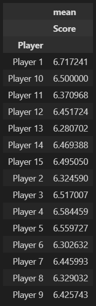
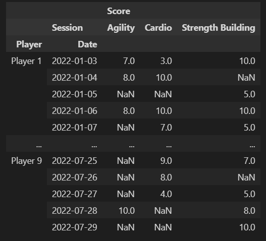
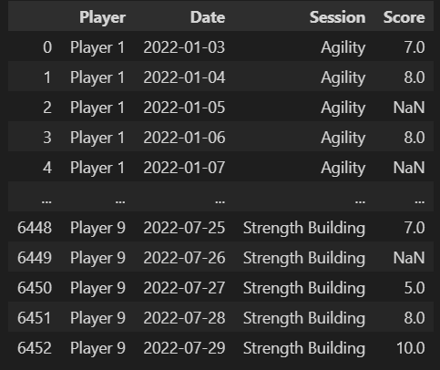

# Advanced Pandas: Pivot Tables
## Introduction
#### Welcome to the world of Advanced Pandas! In this tutorial, we will go over the difference between pivoting and unpivoting and how to make dynamic pivot tables in Pandas.
## Data Source for Interactive Tutorial
#### To help spice things up, you will be provided a text file to use in your preferred IDE to follow along with examples in this tutorial. The text file can be found below:
[Input File](Files/Player-Training.zip)
## Project Setup
#### For the purposes of this tutorial, I will assume you're using a Jupyter Notebook or some other Notebook application. Complete the following steps to start this tutorial:
##### 1. Open your Notebook
##### 2. Import the "pandas" library: import pandas as pd
##### 3. Call the "read_csv" method to import the data file: pd.read_csv('[file path]')
##### 4. Call the "head" method on your new DataFrame to preview the data: [variable name].head()
## What is a Pivot Table?
#### If you're new to the world of Data Analytics, you may be asking yourself, "What exactly is a Pivot Table?" Simply put, a _Pivot Table_ is a type of table that allows you to move columns to rows, known as _Pivoting_, or rows to columns, known as _Unpivoting_. These tables are very useful for looking at data from different perspectives and makes it easy to adjust the level of detail.
## Making a Pivot Table With the pivot_table() Function
#### Because Pivoting and Unpivoting are common data manipulation techniques, Pandas has implemented the _pivot_table()_ function to allow users to access this functionality. To use this function, use the following syntax:
    pd.pivot_table([dataframe name], values=[[column(s) to aggregate]], index=[[column to group by]], columns=[[columns to display (other than the values and index columns)]], aggfunc=[[aggregate function]], sort=True/False)
#### Example:
    pd.pivot_table(players, values=['Score'], index=['Player'], aggfunc=['mean'], sort=False)

## Pivoting a DataFrame
#### One of the pitfalls of the pivot_table function is the fact that it makes it difficult to switch back and forth between different pivots. Pandas recognizes this pitfall and thus includes the _pivot()_ function. This is very similar to the pivot_table function but allows for the data types and underlying structure of the DataFrame to stay in tact. To use this function, use the following syntax:
    [dataframe name].pivot(index=[[column(s) to group by]], columns=[[columns to display (other than the values and index columns)]], values=[[column(s) to aggregate]], aggfunc[[aggregate function(s)]])
#### Example:
    players.pivot(index=['Player', 'Date'], columns=['Session'], values=['Score'])

## Unpivoting a DataFrame
#### When your DataFrame has a large number of columns, it can be nearly impossible to analyze the data. To help with this issue, Pandas offers the _melt()_ function. This is the complete opposite of the pivot() function. To use this function, use the following syntax:
    [dataframe name].melt(id_vars=[[column(s) to NOT unpivot]], value_vars[[columns to unpivot]], var_name='[categorical column name]', value_name='[value column name]')
#### Example:
##### In the previous example, we pivoted the columns, which thus converted the columns into grouped tuples. To convert this from a multi-level index, complete the following steps:
    1.  players.droplevel(level=0, axis=1)
    2.  players.reset_index()
    3.  players.melt(id_vars=['Player', 'Date'], value_vars=['Agility', 'Cardio', 'Strength Building'], var_name='Session', value_name='Score')

## Next Steps
#### Now that you have a solid grasp on the fundamentals of Data Manipulation, let's kick it up a notch with the next tutorial:
- [Date Scaffolding](https://github.com/uvudataclub2022/UVU-2022-2023/blob/Data-Analytics/Data%20Manipulation/Tutorials/Pandas/Date%20Scaffolding.md)
